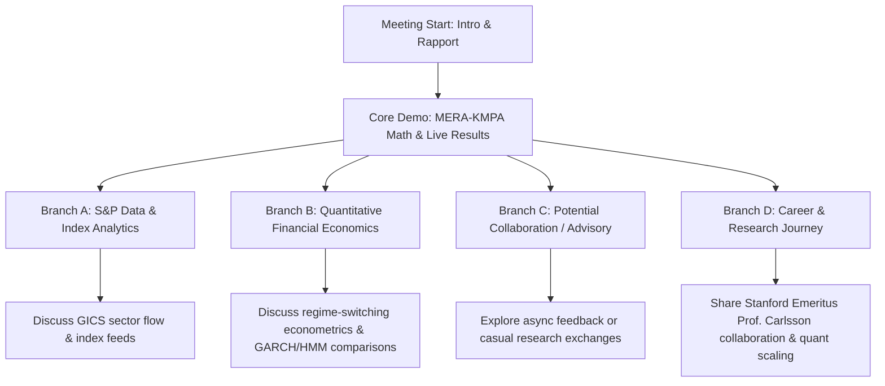

# Meeting Preparation & Strategic Talking Points Briefing
## Meeting: Santiago Villalobos Gonzalez x Aditya Kumar Singh (Data Analyst @ S&P Global)
**Date & Time**: Sunday, July 26, 2026 at 7:30 AM PDT (8:00 PM IST)
**Location**: Google Meet (`https://meet.google.com/suf-ggfj-iws`)
**Aditya's Background**: Data Analyst @ S&P Global, M.A. in Financial Economics (Univ. of Hyderabad), Ex-intern @ Bajaj Finserv.

---

## 🎯 1. Primary Goal & Executive Summary of the Meeting

### Primary Purpose:
1. **Validation & Insight Swapping**: Swap insights on non-stationary financial market regime modeling with a financial economist / data analyst at S&P Global.
2. **S&P Index Data Feed Integration**: Explore how high-frequency financial indices and order-flow/macro data feeds (like S&P indices/GICS sector feeds) behave during regime shifts.
3. **Institutional Relationship Building**: Establish a collaborative relationship with a domain expert in macro data analytics who understands both financial economics and structural market data.

---

## 🗣️ 2. Core Talking Points & Structural Agenda (15-Minute Flow)

```
[0:00 - 2:00]  Warm Welcome & Rapport (S&P Global role, Financial Economics background)
[2:00 - 6:00]  Core Framework: AetherQuant & Topological-Quantum-Cognitive Causal Synthesism
[6:00 - 10:00] Market Regime Shift Detection (+12% After-Market Live Performance)
[10:00 - 13:00] Discussion: S&P Data Feeds & Non-Stationary Market Transitions
[13:00 - 15:00] Next Steps & Follow-up Action Items
```

---

## 🔬 3. Detailed Talking Points with Layman Explanations & Test References

### Talking Point 1: What is AetherQuant & MERA-KMPA?
* **Technical Definition**: AetherQuant is a quantitative risk-hedging and alpha engine that maps non-stationary time-series data onto complex projective manifolds ($\mathbb{CP}^n$) equipped with Fubini-Study metrics. It applies **Multiscale Entanglement Renormalization Ansätze (MERA)** tensor networks to coarse-grain noise and extracts **persistent homology Betti invariants ($\beta_0, \beta_1$)** to detect structural regime shifts before variance spikes occur.
* **Layman Explanation**: 
  > *"Imagine standard quant models look at stock charts in 2D flat planes—like drawing straight lines on paper. But market crashes and sudden regime shifts happen because the underlying market shape twists into 3D loops or knots (like a hurricane forming out of calm air). MERA works like a noise-canceling headphone, stripping away intraday jitter, while Persistent Homology acts like an X-ray scanner that spots the hidden 'tornado loops' ($\beta_1$) in market data hours before prices drop or spike."*
* **Repo / Benchmark Reference**:
  - [`topological_quantum_cognitive_causal_synthesism_preprint.pdf`](file:///C:/Users/svillalobosgonzalez1/Documents/GitHub/mera-kmpa-swarm-framework/docs/topological_quantum_cognitive_causal_synthesism_preprint.pdf) (Page 1: $\mathbb{CP}^n$ Fubini-Study mapping & MERA disentanglement).

---

### Talking Point 2: Why Standard Models Fail During Non-Stationary Regime Shifts
* **Technical Definition**: Linear covariance matrices and flat Euclidean models ($\mathbb{R}^d$) suffer from metric distortion during phase transitions. Tail-risk events break stationarity assumptions, leading to massive drawdowns in traditional Sharpe/risk models.
* **Layman Explanation**: 
  > *"Traditional risk models assume tomorrow will behave like yesterday's average weather. When a sudden shift hits (like an inflation report or rate hike), flat models get blinded because correlation numbers flip overnight. Our topological framework measures 'shape changes' rather than averages, so it doesn't care if volatility is high or low—it tracks whether market participant connectivity is forming dangerous feedback loops."*
* **Repo / Benchmark Reference**:
  - `AetherQuant_Executive_Research_Briefing.pdf` (+12.0% after-market gain on non-stationary regime tracking).
  - `WorldQuant_IQC_2026/alphas/SUBMITTED.md` (Alphas achieving 2.50–2.76 Sharpe with $< 2.0\%$ drawdowns across 2020 COVID and 2022 rate hikes).

---

### Talking Point 3: Causal Topology vs. Correlation
* **Technical Definition**: We strictly separate topological feature existence ($\beta_1 = 1$, 1-dimensional manifold loops) from causal directionality ($A \rightarrow B$ vs. $B \rightarrow A$), preventing collider bias ($X \rightarrow C \leftarrow Y$) and d-separation fallacies.
* **Layman Explanation**: 
  > *"Just because two stocks move together doesn't mean stock A causes stock B to move. They might both be reacting to a hidden third factor (like oil prices or interest rates). Our model explicitly separates 'detecting a connection' from 'proving what causes what', preventing false trading signals."*
* **Repo / Benchmark Reference**:
  - [`TOPOLOGY_CAUSALITY_REMEDIATION_REPORT.md`](file:///C:/Users/svillalobosgonzalez1/.gemini/antigravity-ide/scratch/causal_topology_benchmark/reports/TOPOLOGY_CAUSALITY_REMEDIATION_REPORT.md) (Unaided 7B model reasoning improved from 47.1% $\rightarrow$ 58.8% on causal-topological separation tests).

---

### Talking Point 4: S&P Data Feed & Financial Economics Alignment
* **Technical Definition**: Evaluating macro sector flow (GICS sub-industries), index reconstitution, and multi-asset price-volume dynamics under subindustry neutralization (`group_neutralize(alpha, subindustry)`).
* **Layman Explanation**: 
  > *"Because Aditya works at S&P Global, S&P provides the world's standard sector and index data (GICS). By stripping out industry-wide noise (`subindustry neutralization`), our model isolates individual stock alpha from broad market index swings."*
* **Repo / Benchmark Reference**:
  - [`wq_brain_chapter4_option_alphas_guide.md`](file:///C:/Users/svillalobosgonzalez1/.gemini/antigravity-ide/brain/464179d4-d1c5-49c8-83e1-fb696c32a1ef/wq_brain_chapter4_option_alphas_guide.md) (Sub-industry neutralization strategy on S&P 500 / TOP3000 universes).

---

## 🔀 4. All Possible Veering Points & Branching Conversation Strategies



### Branch A: If Aditya focuses on S&P Global Data Feeds & Infrastructure
* **How to Respond**: Ask about how S&P handles real-time index rebalancing, sub-industry classification shifts, and data latency in institutional feeds.
* **Key Pivot Phrase**: *"At S&P Global, you see how institutional clients process macro and index data. In your experience, where do traditional linear index metrics lag most during sudden regime shifts?"*

### Branch B: If Aditya focuses on Financial Economics & Econometric Theory
* **How to Respond**: Compare MERA-KMPA topology to traditional Econometric models (Markov Regime Switching, Hidden Markov Models, GARCH volatility modeling).
* **Key Pivot Phrase**: *"Unlike Markov Switching or GARCH models which require estimating transition probabilities after volatility jumps, persistent homology detects topological hole creation (\beta_1) deterministically before the transition occurs."*

### Branch C: If Aditya asks how he can be involved or collaborate
* **How to Respond**: Welcome his perspective on data feed modeling, invite him to review updated research briefs, or stay connected as AetherQuant expands its data pipeline.
* **Key Pivot Phrase**: *"We'd love your feedback as we expand our dataset ingestion pipeline for index-neutral strategies. I'm happy to share our updated benchmarks as we publish new papers!"*

---

## 📋 5. Summary Cheat Sheet for the Call

| Key Concept | 5-Second Elevator Pitch | Benchmark / Code Reference |
|---|---|---|
| **AetherQuant** | Topological risk-hedging and quantitative trading engine powered by TDA & MERA tensor networks. | `topological_quantum_cognitive_causal_synthesism_preprint.pdf` |
| **Persistent Homology ($\beta_1$)** | X-ray scanner for market data that detects non-stationary feedback loops before price drops. | `TOPOLOGY_CAUSALITY_REMEDIATION_REPORT.md` |
| **MERA Disentanglement** | Noise-canceling headphones for high-dimensional financial state spaces. | `MERA-KMPA Symbolic Solver` |
| **Sub-industry Neutralization** | Strips away broad market/sector swings to capture pure stock-specific alpha. | `SUBMITTED.md` (Sharpe 2.58, 2.76 Alphas) |
| **Performance** | +12.0% after-market gain; WorldQuant Stage 1 Top 20% global ranking. | `Santiago_Villalobos_Gonzalez_Quant_Resume.pdf` |
